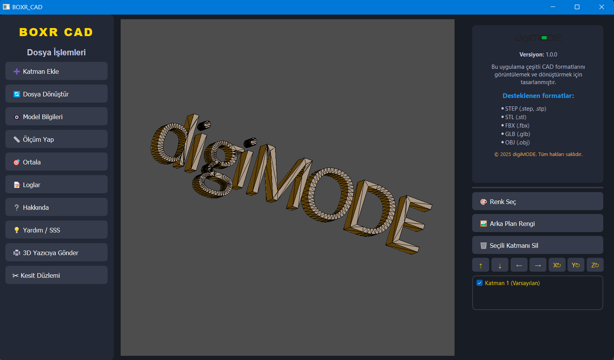

# BOXR_CAD




## ✨ Temel Özellikler

*   **Gelişmiş 3D Görüntüleyici:**
    *   STEP, IGES, STL, OBJ gibi popüler CAD ve mesh formatlarını destekler.
    *   Katman tabanlı model yönetimi.
    *   Modeli taşıma, döndürme ve yakınlaştırma.
    *   Renk ve arka plan değiştirme.
*   **Model Analizi ve Ölçüm:**
    *   Vertex, kenar ve yüzey bazında detaylı bilgi alma.
    *   İki nokta arası mesafe ölçümü.
    *   Kesit düzlemi oluşturma ve kesiti ayrı bir model olarak kaydetme.
*   **Dosya Formatı Dönüştürme:**
    *   OBJ, STL, GLB, FBX gibi formatlar arasında dönüşüm yapabilme.
*   **Modern ve Kullanıcı Dostu Arayüz:**
    *   Sürükle-bırak ile kolayca dosya ekleme.
    *   Koyu tema ve sezgisel panel düzeni.

## 🛠️ Kullanılan Teknolojiler

*   **Arayüz (GUI):** [PyQt5](https://riverbankcomputing.com/software/pyqt/intro)
*   **3D Görüntüleme:** [PythonOCC](https://github.com/tpaviot/pythonocc-core)
*   **Mesh İşlemleri:** [Trimesh](https://trimsh.org/)
*   **Programlama Dili:** Python 3

## 🚀 Kurulum ve Çalıştırma

1.  **Gerekli Kütüphaneleri Yükleyin:**
    Projeyi çalıştırmak için aşağıdaki kütüphanelerin sisteminizde kurulu olması gerekmektedir.

    ```bash
    pip install PyQt5 pythonocc-core trimesh
    ```

2.  **Uygulamayı Başlatın:**
    Proje dizinindeyken aşağıdaki komutu çalıştırın:

    ```bash
    python main.py
    ```

## 📂 Proje Yapısı

*   `main.py`: Uygulamanın ana giriş noktası. QApplication'ı başlatır.
*   `arayuz_design.py`: PyQt5 ile oluşturulmuş ana arayüz penceresi, paneller ve butonların mantığını içerir.
*   `cad_viewer.py`: PythonOCC tabanlı 3D görüntüleyici widget'ını ve model ile ilgili işlemleri (yükleme, gösterme, taşıma vb.) yönetir.
*   `converter.py`: `trimesh` kütüphanesini kullanarak dosya formatları arasındaki dönüşüm fonksiyonlarını barındırır.
*   `dosyalarım/`: Uygulama tarafından kullanılan veya oluşturulan dosyaların saklandığı dizin.
*   `uygulama.log`: Uygulamanın çalışma zamanı loglarının tutulduğu dosya.

## 🤝 Katkıda Bulunma

Katkılarınız projeyi daha iyi hale getirmemize yardımcı olur. Lütfen bir "issue" açarak veya "pull request" göndererek katkıda bulunun.

1.  Projeyi Fork'layın.
2.  Yeni bir Feature Branch oluşturun (`git checkout -b feature/AmazingFeature`).
3.  Değişikliklerinizi Commit'leyin (`git commit -m 'Add some AmazingFeature'`).
4.  Branch'inizi Push'layın (`git push origin feature/AmazingFeature`).
5.  Bir Pull Request açın.

## 📄 Lisans

Bu proje MIT Lisansı altında lisanslanmıştır. Daha fazla bilgi için `LICENSE` dosyasına bakın.
